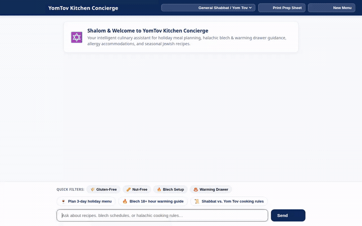

# YomTov Kitchen Concierge 🍽️🕯️

[](https://cloud.google.com/vertex-ai)
[](https://github.com/google/adk)
[](https://a2a-protocol.org/)
[](https://yomtov-kitchen-frontend-821049907373.us-east1.run.app)
[](https://python.org)
[](#-automated-testing--quality)

> **A conversational agent that helps Jewish families and holiday hosts plan festive meal menus, kitchen prep timelines, blech/warming drawer management, and grocery lists tailored to guest dietary needs, multi-day leftover strategies, Chol HaMoed transitions, and halachic cooking priorities (where Shabbat rules take precedence over Yom Tov) with a catalog of warming-safe seasonal Jewish recipes and holiday schedules.**

---

## 🎬 Agent in Action



*Live demonstration: Holiday selection and dietary filter chips → Allergy-accommodated Rosh Hashanah dinner planning with candle-lighting blech schedule → Multimodal Gemini table image generation → Scaled consolidated grocery list categorized by aisle and saved to Firestore.*

---

## 🚀 What Was Added Since Initial Inception

Building from our initial [project_brief.md](project_brief.md), the system evolved from a foundational command-line prototype into a full-stack, enterprise-grade AI assistant with deep multi-service integrations:

1. **Custom Web Chat Frontend on Cloud Run ([frontend/](frontend/))**:
   - Built a custom, responsive chat interface that communicates with the deployed Agent Engine via the streaming **A2A Protocol**.
   - Added a deep navy visual theme, dynamic holiday selector dropdown (*Rosh Hashanah, Sukkot, Pesach, Shavuot, General Shabbat*), interactive filter chips (*Gluten-Free, Nut-Free, Blech Setup, Warming Drawer*), context-aware example prompts, and one-click printable prep sheets.
   - Deployed and live on **Google Cloud Run**: [`https://yomtov-kitchen-frontend-821049907373.us-east1.run.app`](https://yomtov-kitchen-frontend-821049907373.us-east1.run.app).

2. **Dedicated Plain-Text Recipe Endpoints (`/recipe/{slug}`)**:
   - Eliminated external storage access issues (`NoSuchBucket` XML errors) by introducing native `@app.get("/recipe/{recipe_id}")` routes.
   - Serves clean, lightweight, formatted plain-text recipe files directly from Firestore and the fallback catalog with `Content-Disposition: inline`.

3. **Triple-Layer A2UI Sanitization & Mini-Renderer**:
   - Engineered client-side and server-side guards preventing raw A2UI JSON structures (`"explicitList"`, `"literalString"`) from ever leaking into chat bubbles.
   - Implemented a lightweight browser-native A2UI mini-renderer that translates Card, Column, Row, List, and Image structures into styled DOM elements with instant fallback to sanitized markdown.

4. **Resilient Multi-Recipe Grocery Scaling Engine**:
   - Upgraded `generate_grocery_list` with a robust **5-stage matching pipeline** (*Exact ID → Title Slug → Substring → Word Overlap → Fallback Catalog → Auto-Synthesis*) so no recipe is dropped even when prompted with colloquial dish names.
   - Integrated dynamic numerical multiplier support for both fractions (`1 1/2` → `3`) and integers based on guest headcount ($8\text{ guests} = 2.0\times$).
   - Categorized ingredients by supermarket aisles (*Produce, Meat & Poultry, Fish, Refrigerated & Eggs, Pantry & Seasonings*) with halachic *Meat* / *Pareve* badges, persisting each list to Firestore.

5. **Kosher Web Recipe Discovery Tool (`search_and_save_kosher_web_recipe`)**:
   - Implemented an automated web search tool for kosher recipes that evaluates strict kashrut requirements (no mixing meat and dairy, certified kosher ingredients), formats step-by-step prep instructions, and persists newly approved recipes straight to Firestore.

6. **Real-Time Gemini Multimodal Image Generation (`gemini-3.1-flash-lite-image`)**:
   - Integrated `generate_holiday_image` generating holiday dish presentations, plated servings, and festive dinner table photography.
   - Uploads generated imagery directly to a public Cloud Storage bucket with instant visual embedding in chat bubbles.

7. **Automated Playwright Video Recording & Looping GIF Pipeline**:
   - Authored [scripts/record_demo.py](scripts/record_demo.py) using Playwright to script smooth, realistic user interactions.
   - Encoded the session into high-definition H.264 MP4 and converted it into an optimized, looping demo GIF with two-pass palette generation.

8. **Expanded Test Suite**:
   - Reached **25 unit tests** passing at 100% in `tests/unit/` covering planning tools, fuzzy matching, memory persistence, image generation, and Firestore database operations.

---

## 🌟 Key Features

### 1. Zero-Tolerance Household & Guest Dietary Memory
- Integrates with **Vertex AI Memory Bank** to retain guest profiles across sessions:
  - Severe and mild allergies (celiac/gluten, peanuts, tree nuts, sesame, eggs, dairy).
  - Kashrut traditions (Ashkenazi vs. Sephardic, Kitniyot customs, meat/dairy waiting intervals).
  - Kitchen equipment constraints (blech, warming drawer, hot plate, Crock-Pot).
- **Zero-Tolerance Enforcement**: Recipes containing restricted allergens are strictly excluded from meal plans when affected guests attend.

### 2. Multi-Day Dish Rotation & 3-Criteria Feedback System
- Remembers past holiday meal plans to prevent menu exhaustion across multi-day Yom Tov cycles (e.g., Rosh Hashanah into Shabbat, or 3-day holiday weekends).
- Evaluates dishes on a 1–5 scale across three distinct dimensions:
  - **Crowd Rating (1–5)**: Overall taste and popularity with guests.
  - **Ease of Prep (1–5)**: Pre-holiday preparation complexity and kitchen stress.
  - **Yom Tov Suitability (1–5)**: Durability on the blech or warming drawer over 12–36 hours without scorching or turning soggy.

### 3. Jewish Calendar & Halachic Rule Engine (Hebcal Integration)
- Live integration with the **Hebcal API** to fetch exact holiday schedules, candle lighting times, and Havdalah times for any US ZIP code or city.
- Automatically calculates cooking permissions:
  - **Shabbat–Yom Tov Overlaps**: Shabbat restrictions strictly override Yom Tov permissions (zero cooking or flame transfer permitted).
  - **Yom Tov Days**: Allows transferring flame from an existing source for same-day meal prep.
  - **Eruv Tavshilin**: Alerts and verifies prep permissions when Yom Tov precedes Shabbat.
  - **Hachanah Safeguards**: Enforces that Day 2 preparations never commence before nightfall of Day 1.

### 4. Blech & Warming Drawer Thermal Physics Scheduling
- Computes exact holding durations for each dish based on meal sequencing (Friday night dinner, Shabbat lunch, Yom Tov Day 2 dinner).
- Assigns physical stovetop zones:
  - **Center Zone (Direct Heat)**: Boiling soups and heavy braises.
  - **Mid-Blech (Moderate Heat)**: Roast chickens, briskets, and vegetable tagines.
  - **Perimeter (Gentle Heat)**: Kugels, baked goods, and delicate side dishes.
- Formulates liquid evaporation compensation (+1/2 cup to +1 cup broth, double crimped foil).
- Enforces pre-Chag milestones: 90m preheat, 45m rolling boil (Ma'achal Ben Drusai), 25m staging, and the exact candle-lighting cutoff.

### 5. Scaled Consolidated Grocery Lists
- Consolidates ingredients across all chosen menu items, scaling quantities proportionally to headcount ($8\text{ guests} = 2.0\times$).
- Groups items into supermarket aisles (*Produce, Meat & Poultry, Fish, Refrigerated & Eggs, Pantry & Seasonings*).
- Tags each item with halachic kashrut badges (*Meat*, *Pareve*, *Dairy*) and saves the list to Firestore with a unique document ID.

### 6. Authentic Kosher Food Blog Search (Vertex AI RAG Engine)
- Grounded on a curated corpus of 38+ authentic, community-tested recipes from leading kosher food writers:
  - **Melinda Strauss** (*melindastrauss.com*)
  - **Naomi Nachman / The Aussie Gourmet** (*naominachman.com*)
  - **Ruhama Shitrit / Ruhama's Food** (*ruhamasfood.com*)
- Retrieved semantically via Vertex AI Vector Search to suggest authentic holiday dishes.

### 7. AI Visual Presentations (`gemini-3.1-flash-lite-image`)
- Creates appetizing food photography and festive holiday table scenes using `gemini-3.1-flash-lite-image`.
- Automatically uploads generated media to Google Cloud Storage and displays it inline in the chat conversation.

### 8. Isolated Code Execution Sandbox
- Runs Python algorithms on **AgentEngineSandboxCodeExecutor** within Vertex AI Agent Engine.
- Calculates evaporation curves, liquid-to-solid braising ratios, and portion multiplier matrices for multi-day gatherings.

---

## ☁️ Google Cloud & AI Platform Architecture

| Google Cloud Tool / Service | Purpose & Implementation |
| :--- | :--- |
| **Vertex AI Memory Bank** | Long-term cross-session memory service (`PreloadMemoryTool` & after-agent callbacks) storing persistent household profiles, guest allergies, past holiday menus, and 3-criteria dish feedback. |
| **Google Cloud Firestore (Native)** | High-performance NoSQL database storing structured holiday recipes, warming guidelines, evaporation compensation parameters, user ratings, and categorized grocery lists. |
| **Google Cloud Storage (GCS)** | Object storage bucket (`yomtov-kitchen-media-qwiklabs-gcp-04-ded35b1abcfb`) hosting recipe datasets, RAG knowledge files, and AI-generated recipe/blech imagery. |
| **Vertex AI RAG Engine** | Serverless semantic retrieval corpus indexed with authentic kosher recipes from top culinary blogs, queried via semantic retrieval tool `search_recipe_rag_corpus`. |
| **Image Generation (`gemini-3.1-flash-lite-image`)** | Multimodal image generation in the `global` region producing dish photography and blech diagrams, saving session artifacts in ADK and uploading to Cloud Storage. |
| **Code Execution Sandbox (`AgentEngineSandboxCodeExecutor`)** | Secure Python execution environment on Vertex AI Agent Engine for exact calculations of liquid evaporation rates, portion scaling, and prep scheduling. |
| **A2UI (Agent-to-User Interface)** | Interactive UI card specifications designed to render multi-day meal timelines, blech layout maps, and recipe step cards in the web frontend. |
| **Agent Engine / Reasoning Engine** | Managed deployment runtime hosting the ADK agent with full A2A Protocol compliance and enterprise telemetry (`projects/821049907373/locations/us-east1/reasoningEngines/5254198832257826816`). |
| **Google Cloud Run** | Serverless container hosting the custom FastAPI frontend proxy (`yomtov-kitchen-frontend`). |

---

## 📁 Repository Structure

```
yomtov-kitchen-concierge/
├── app/
│   ├── agent.py                        # Root ADK agent prompt, model config & tool binding
│   ├── a2ui_utils.py                   # A2UI callback and JSON sanitization pipeline
│   ├── fast_api_app.py                 # FastAPI backend server with A2A endpoints
│   └── app_utils/
│       ├── a2a.py                      # A2A client connector
│       ├── memory_tools.py             # Memory Bank tools (profiles, rotation, ratings)
│       ├── firestore_tools.py          # Firestore database tools (search, save, ratings)
│       ├── planning_tools.py           # Hebcal API, blech scheduler, grocery scaler
│       ├── rag_tools.py                # Vertex AI RAG retrieval tool
│       ├── image_tools.py              # gemini-3.1-flash-lite-image generator & GCS uploader
│       ├── web_recipe_tools.py         # Kosher web recipe discovery & verification
│       ├── services.py                 # Client initialization (Memory Bank, Firestore)
│       └── reasoning_engine_adapter.py # Agent Engine runtime adapter
├── frontend/
│   ├── Dockerfile                      # Cloud Run container definition
│   ├── main.py                         # FastAPI proxy server (A2A client, /recipe endpoints)
│   ├── requirements.txt                # Frontend Python dependencies
│   └── static/
│       └── index.html                  # Responsive chat UI, filter chips, A2UI mini-renderer
├── data/
│   ├── halacha_and_culinary_guide.md   # Halachic reference documentation
│   ├── rag_recipes.txt                 # Consolidated 38-recipe corpus document
│   └── recipes/                        # 38 individual scraped recipe markdown files
├── scripts/
│   ├── record_demo.py                  # Automated Playwright demo video recording script
│   ├── seed_firestore.py               # Seeds canonical warming-safe holiday recipes
│   ├── seed_menu_recipes.py            # Seeds all extended menu items into Firestore
│   ├── download_recipes.py             # Kosher blog scraper (Melinda, Naomi, Ruhama)
│   ├── create_rag_corpus.py            # Vertex AI RAG corpus provisioning script
│   └── create_halachic_rag_corpus.py   # Halachic RAG corpus generator
├── tests/
│   ├── unit/                           # 25 unit tests (planning, scaling, memory, firestore)
│   ├── integration/                    # E2E integration tests (RAG, agent flows, A2A)
│   └── eval/                           # Quality flywheel evaluation dataset & configs
├── demo.gif                            # Optimized looping demo animation (embedded above)
├── demo_video.mp4                      # Full high-definition recording (H.264 MP4)
├── project_brief.md                    # Original project brief & design specs
├── pyproject.toml                      # Project dependencies & configurations
└── README.md                           # Comprehensive documentation
```

---

## 🧪 Automated Testing & Quality

All core planning algorithms, fuzzy matchers, and cloud service wrappers are thoroughly covered by unit and integration tests:

```bash
# Run the complete unit test suite (25 tests)
GOOGLE_GENAI_USE_VERTEXAI=true uv run pytest tests/unit/
```

**Test Coverage Highlights**:
- `test_generate_grocery_list_multi_recipe_fuzzy`: Tests 11 diverse recipes across exact IDs, slugs, and auto-synthesized unknown dishes scaled at $2.0\times$.
- `test_calculate_blech_schedule`: Validates candle-lighting deadlines, evaporation liquid compensation, and zone placement.
- `test_lookup_jewish_calendar`: Verifies Hebcal calendar lookup and Shabbat–Yom Tov overlap detection.
- `test_memory_tools` & `test_firestore_tools`: Confirms allergy persistence, zero-tolerance filtering, and recipe database queries.
- `test_image_tools`: Validates `gemini-3.1-flash-lite-image` call signatures and Cloud Storage bucket uploads.

---

## 🚀 Local Development & Deployment

### 1. Prerequisites
- Python 3.11+
- [uv](https://docs.astral.sh/uv/) package manager
- [Google Cloud SDK](https://cloud.google.com/sdk/docs/install) (`gcloud`) authenticated with your project:
  ```bash
  gcloud auth login
  gcloud auth application-default login
  gcloud config set project <your-project-id>
  ```
- [agents-cli](https://github.com/google/agents-cli):
  ```bash
  uv tool install google-agents-cli
  ```

### 2. Local Setup
```bash
# Clone the repository
git clone https://github.com/AvivaShooman/buildwithgemini-yomtov-kitchen-concierge.git
cd buildwithgemini-yomtov-kitchen-concierge

# Install dependencies using uv
uv sync
```

### 3. Run the Agent Locally in ADK Playground
```bash
agents-cli playground
```
Navigate to `http://localhost:8000` to interact with the agent, view session artifacts, and inspect tool calls.

### 4. Run the Web Frontend Locally
```bash
cd frontend
AGENT_ENGINE_RESOURCE_NAME="projects/<project-number>/locations/us-east1/reasoningEngines/<engine-id>" \
PORT=8080 uv run python3 main.py
```
Open `http://localhost:8080` to experience the custom chat UI.

### 5. Deploying to Google Cloud
```bash
# Deploy the ADK Agent to Vertex AI Agent Platform Reasoning Engine
uv run agents-cli deploy --project <your-project-id> --region us-east1 --no-confirm-project

# Deploy the Frontend Proxy to Cloud Run
cd frontend
gcloud run deploy yomtov-kitchen-frontend \
  --source . \
  --region us-east1 \
  --project <your-project-id> \
  --set-env-vars AGENT_ENGINE_RESOURCE_NAME=projects/<project-number>/locations/us-east1/reasoningEngines/<engine-id> \
  --quiet
```

---

## 📜 Halachic Cooking Notice

*YomTov Kitchen Concierge provides culinary planning, evaporation compensation guidelines, and warming timelines based on standard halachic principles regarding Shabbat, Yom Tov, Havdalah, and blech management. Because customs vary (e.g., Ashkenazi vs. Sephardic, Chabad, Rav Moshe Feinstein vs. Rav Ovadia Yosef), always consult your local Orthodox rabbi or halachic authority for definitive personal rulings.*

---

## 🏗️ Terraform Infrastructure Deployment

```bash
# 1. Initialize Terraform
terraform init

# 2. Plan the deployment
terraform plan -var="project_id=<YOUR_PROJECT_ID>"

# 3. Apply infrastructure to Google Cloud
terraform apply -var="project_id=<YOUR_PROJECT_ID>" -auto-approve
```
